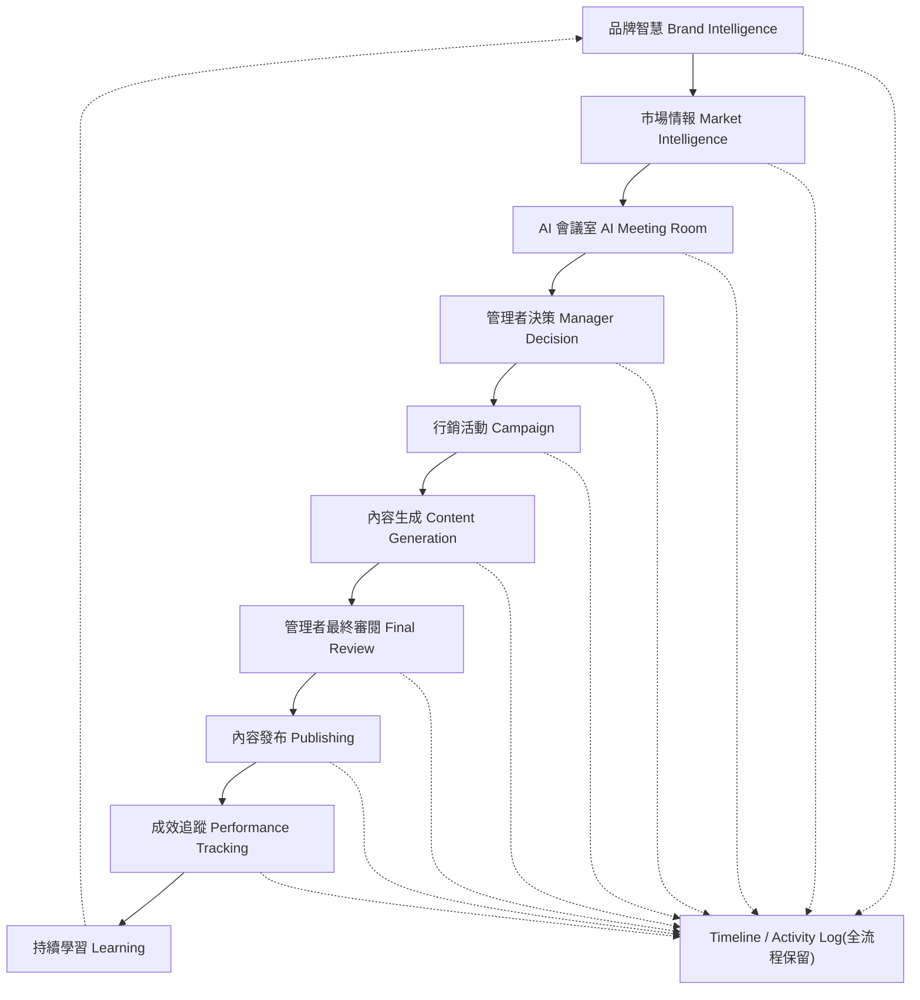

# 01. 核心價值與第一性原則

## 核心價值

GO Marketing Center 的定位不是「AI 自動幫品牌發文」，而是：

> AI 協助品牌思考，管理者負責最終決策。AI 永遠不取代品牌經營者。

AI 的責任範圍：

- 蒐集資訊
- 市場分析
- 品牌分析
- Brainstorm
- 提出策略
- 提供不同方案
- 預估風險
- 預估成效
- 協助生成內容

真正的商業決策永遠由管理者完成。

## 七大第一性原則

### Principle 1 — Every Brand Has Its Own Identity

每個品牌都有自己的品牌人格，不能互相污染。系統中的每個品牌（Homigo、TaskGo、Washgo…）都是獨立實體，各自擁有自己的語調、視覺、規則。

### Principle 2 — Brand Knowledge Never Mixes

品牌知識永遠不能互相混用。所有 AI Context 都必須依照 `brand_id` 載入，禁止共用品牌知識。

> 實例驗證：在整合 Homigo / TaskGo / Washgo 三份既有行銷文件時，發現彼此對「Washgo 是否已上線」描述互相矛盾——這正是缺乏本原則會發生的典型問題。解法見 [07-collaboration.md](07-collaboration.md)。

### Principle 3 — Collaboration Requires Permission

品牌之間可以合作，但合作一定要建立 Collaboration Workspace，不能直接共用彼此資料。AI 只能存取 `collaboration_briefs`，不得跨讀對方完整的 Brand Knowledge。

### Principle 4 — AI Can Debate

AI 可以討論、可以提出不同意見、可以 Brainstorm。AI Meeting Room 中不同角色（品牌 AI、Market Analyst、Risk Advisor、Devil's Advocate…）可以互相挑戰觀點。

### Principle 5 — AI Never Makes Business Decisions

AI 永遠沒有決策權。AI 討論後只能形成 Proposal（方案 A / B / C），絕不能自行核准。

### Principle 6 — Managers Always Own The Final Decision

所有重大決策都必須經過管理者確認：活動、發文、合作、影片、品牌策略。AI 不得自行發布。

### Principle 7 — Every Decision Is Traceable

所有決策都必須留下完整紀錄，可回溯：誰提出、誰修改、誰批准、什麼時間、哪個 AI、哪個品牌。對應資料表：`activity_logs`。

## 整體流程架構

## 原則如何落實到系統設計

| 原則 | 落實方式 |
|---|---|
| P1 品牌人格獨立 | `brands` 為根實體，幾乎所有表帶 `brand_id` |
| P2 知識不互混 | 資料庫外鍵強制隔離；AI Task 無 `brand_id` 即拒絕執行 |
| P3 合作需許可 | `collaborations` / `collaboration_briefs`，禁止跨讀 |
| P4 AI 可辯論 | `meetings` / `meeting_messages`，多 Agent 身份制 |
| P5 AI 無決策權 | `proposals` 由 AI 建立，`decisions` 只能由 `users` 寫入 |
| P6 管理者最終決策 | `content_reviews`、`decisions` 強制 `reviewer_id` / `decided_by` 為人類 |
| P7 全程可追溯 | `activity_logs` 統一事件流，記錄 actor/before/after |
