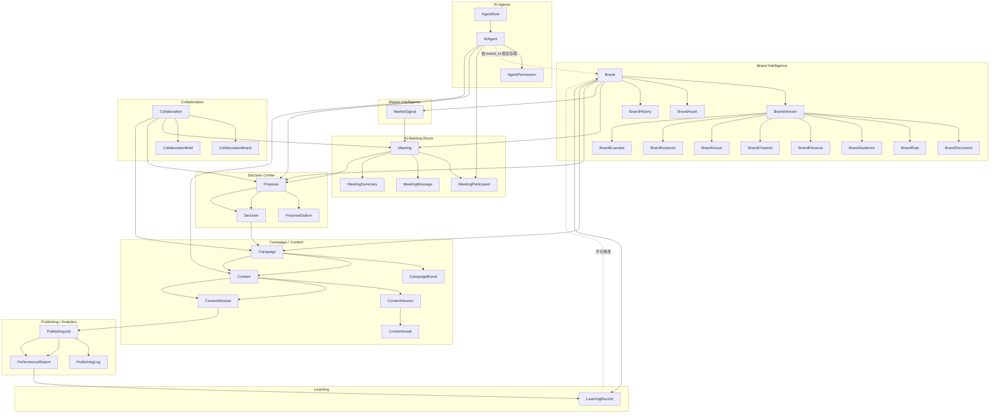
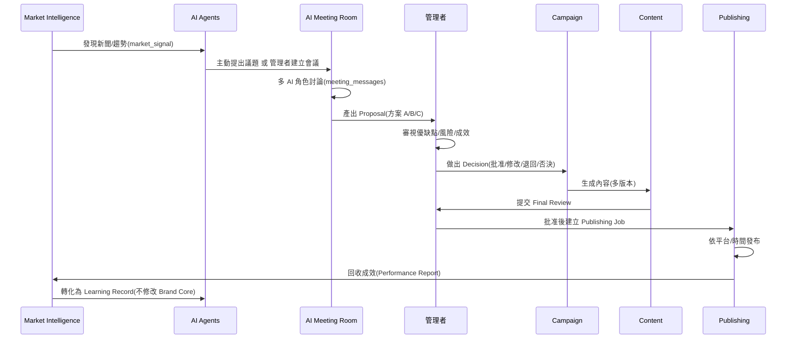

# 02. Domain Model 與 Entity 關係

## 高層領域關係圖

## 核心生命週期時序

## 實體清單與所屬模組

| 模組 | 實體 |
|---|---|
| 身分與權限 | `users`, `brand_members`, `ai_agents`, `agent_roles`, `agent_permissions` |
| Brand Intelligence | `brands`, `brand_versions`, `brand_documents`, `brand_assets`, `brand_audiences`, `brand_personas`, `brand_rules`, `brand_visuals`, `brand_channels`, `brand_keywords`, `brand_histories`, `brand_examples` |
| Market Intelligence | `market_signals` |
| Collaboration | `collaborations`, `collaboration_brands`, `collaboration_briefs` |
| AI Meeting Room | `meetings`, `meeting_participants`, `meeting_messages`, `meeting_summaries` |
| Decision Center | `proposals`, `proposal_options`, `decisions` |
| Campaign / Content | `campaigns`, `campaign_brands`, `contents`, `content_versions`, `content_assets`, `content_reviews` |
| Publishing / Analytics | `publishing_jobs`, `publishing_logs`, `performance_reports` |
| Learning | `learning_records` |
| Timeline | `activity_logs` |

完整欄位定義請參考 [db/schema.sql](../db/schema.sql) 與 [03-database.md](03-database.md)。

## 關鍵設計決策

1. **Proposal 與 Decision 分離**：`proposals` 由 AI 建立、`decisions` 只能由 `users` 寫入，資料庫結構本身即強制 Principle 5/6。
2. **`meetings` / `proposals` / `campaigns` 皆可綁定 `brand_id` 或 `collaboration_id`**：單一品牌事務走 `brand_id`，跨品牌事務走 `collaboration_id`，兩者互斥但至少擇一（見 schema 的 CHECK 約束）。
3. **`contents.brand_version_id`**：每篇內容生成當下都鎖定使用的品牌知識版本，未來回溯時能重建「那時候 AI 看到的品牌樣貌」。
4. **`content_versions` 而非直接覆蓋 `contents`**：所有重新生成、修改都留痕，`content_reviews` 記錄每一輪人工審閱意見。
5. **`learning_records` 獨立於 `brand_versions`**：Learning 只能新增觀察紀錄，物理上無法修改 `brands`/`brand_versions` 資料表。
