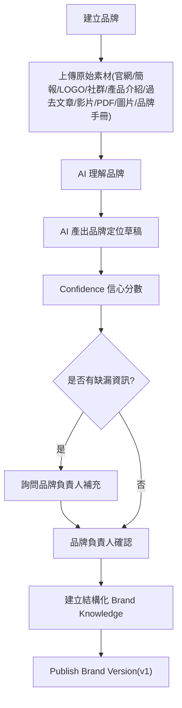
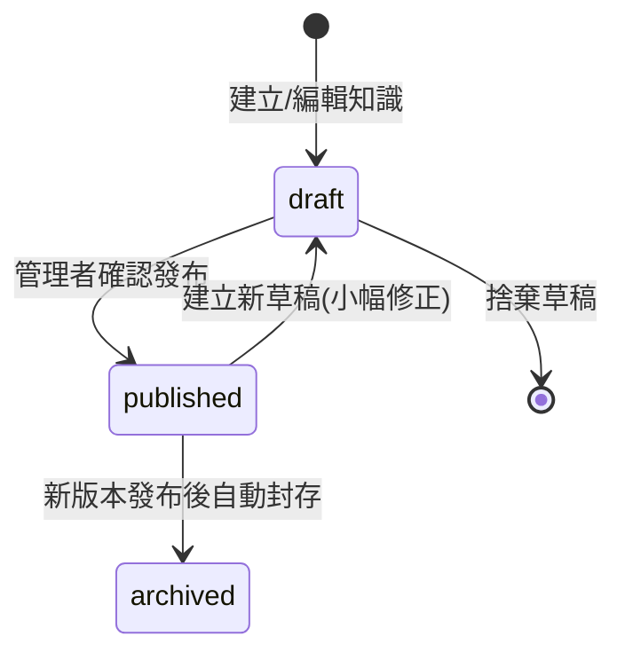

# 06. Brand Intelligence 架構

## Brand Knowledge 的組成

Brand Knowledge 不是一份 Markdown，而是一組結構化資料，Markdown 只是發布時自動編譯出的成品（見 [08-brand-markdown-spec.md](08-brand-markdown-spec.md)）：

| 知識類型 | 對應資料表 |
|---|---|
| Brand Core（定位、Slogan、故事） | `brand_versions`(欄位化於 compiled 內容中) |
| Audience / Persona | `brand_audiences`, `brand_personas` |
| Voice（語氣指南） | `brand_channels`(每平台) + brand core 敘述 |
| Visual（視覺識別） | `brand_visuals` |
| Content Strategy（內容支柱） | `brand_examples`(category = content_pillar) |
| Marketing Rules / Negative Rules | `brand_rules` |
| Competitor | `brand_examples`(category = competitor，未來擴充) |
| Brand Examples（敘事素材） | `brand_examples` |
| History（里程碑） | `brand_histories` |
| Assets（Logo / Media / Documents） | `brand_assets`, `brand_documents` |
| Website / FAQ | `brand_documents`(source_type = website / faq) |
| Press Coverage（媒體報導／社會證明） | `press_coverages`（第三方露出；不存全文） |
| Press Release（自家新聞稿） | `press_releases`（可存全文；草稿→審核→定稿） |

原始資料（官網截圖、簡報 PDF、舊版 MD 檔）永久保留在 `brand_documents`，不會因為結構化拆解而遺失，確保未來重新解讀或稽核時可回到源頭。

## Brand Onboarding AI 流程

- 每個步驟都寫入 `activity_logs`，記錄 AI 產出與人工確認的分界點
- `brand_versions.confidence_score` 記錄 AI 對本次產出的信心程度，供品牌負責人判斷是否需要更仔細審查
- 缺漏資訊的追問以結構化問題呈現（例如「找不到明確的目標受眾年齡層，請補充」），而非要求使用者自由填寫長文

## Brand Version 生命週期

### 小幅修正 vs 重大再定位

| 情境 | 流程 |
|---|---|
| 小幅修正(資料錯誤、過時) | Brand Intelligence 頁直接編輯知識條目 → 存入 draft → 管理者確認發布 → 版本號 +1 |
| 重大再定位(如產品線改變) | 走 Re-onboarding：重跑 Onboarding AI、上傳新素材 → AI 產出新定位草稿 + 與舊版差異清單 + 標記受影響的舊知識(保留/修改/封存) → 品牌負責人逐項確認 → 發布新版 |

### 版本發布的連動效應

- 進行中的 Campaign、待決策 Proposal、待審閱 Content 會被標記「品牌版本已變更，需重新確認」
- AI Task 立即改為載入新版 Brand Knowledge
- 已發布的舊內容維持綁定原本的 `brand_version_id`，不受影響，可回溯「當時 AI 依據的品牌樣貌」
- `learning_records` 帶 `brand_version_id`，舊版時代學到的成效洞察不會污染新版判斷

### AI 對品牌知識的角色邊界

AI 可以偵測到品牌現況與知識庫不符（例如官網已改版、新產品上線），並提出「品牌知識修改建議」，但永遠無法直接寫入已發布版本；一切修改都必須先進入 draft，再經管理者確認才能發布，對應 Principle 5/6。

## 知識條目編輯模式（人性化，不直接編 Markdown）

管理者永遠不直接編輯 Markdown 語法。資料流向為：結構化條目（唯一事實來源）→ 表單/卡片式編輯介面 → 發布時自動編譯為 Markdown（唯讀成品）。

| 知識類型 | 編輯介面 |
|---|---|
| 事實邊界/禁止事項 | 條列卡片：可宣稱/不可宣稱開關、驗證狀態下拉、失效日期選擇器 |
| Persona | 欄位式卡片：年齡層、痛點清單、訴求角度 |
| Hashtag/關鍵字 | 標籤輸入框 |
| 平台調性 | 每平台一張設定卡：語氣、字數範圍、格式 |
| 色票/視覺 | 色彩選擇器 + 上傳 |
| 品牌故事等長文 | 所見即所得編輯器(WYSIWYG) |

進階使用者可在「原始檢視」分頁查看編譯後的完整 Markdown（唯讀），供匯出或人工全覽使用。

## 三個真實品牌的知識落地範例

Homigo、TaskGo、Washgo 三份既有行銷文件已作為 V1 種子資料拆解進上述結構（見 [db/seed.sql](../db/seed.sql) 與 `data/brands/`）。過程中發現的品牌間矛盾描述（如 Washgo 上線狀態不一致）已抽出至 Collaboration 層處理，見 [07-collaboration.md](07-collaboration.md)。
