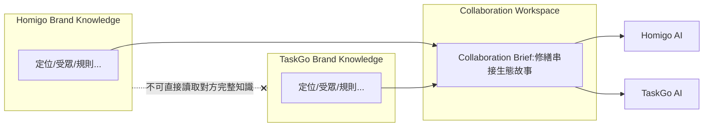
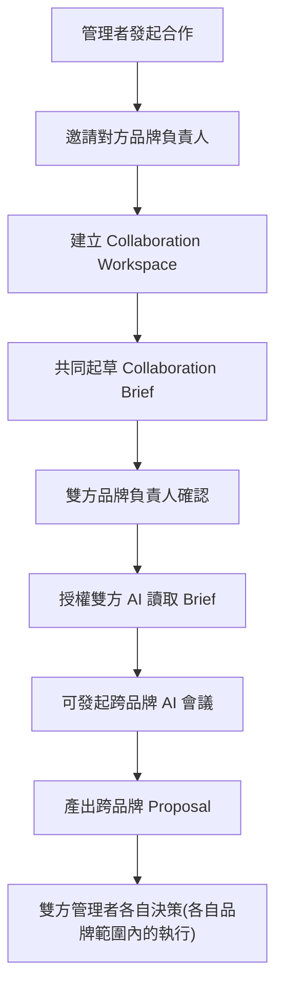

# 07. Collaboration（品牌合作）架構

## 為什麼需要 Collaboration Workspace

Principle 3 規定：品牌之間可以合作，但不能直接共用彼此資料。實務上驗證了這個必要性——在整合 Homigo、TaskGo、Washgo 三份既有行銷文件時，發現：

- Homigo 文件描述 Washgo 為「已可用的生活服務入口」
- TaskGo 文件描述 Washgo「規劃中、尚未上線、不得生成貼文」
- Washgo 自己的文件則是完整已上線的營運聖經

三份文件對同一件事各執一詞，且會隨時間各自過期。這正是「品牌知識互相污染」的實例：跨品牌的描述被複製、內嵌進了各自的知識庫，而非維護單一事實來源。

## 解法：Collaboration Workspace

- 任何跨品牌合作，第一步是建立 `collaborations` 記錄與 `collaboration_brands` 關聯
- 雙方品牌負責人共同維護一份 `collaboration_briefs`：只描述「合作範圍內」的必要資訊（例如：Homigo 報修單如何流向 TaskGo 派工），不包含各自完整的 Brand Knowledge
- 參與該合作的 AI（透過 `agent_permissions.scope = read_collaboration_brief`）只能讀取 Brief，無法讀取對方品牌的 `brand_rules`、`brand_audiences` 等完整資料

## V1 的第一個真實 Collaboration 範例

「Homigo × TaskGo 修繕串接」生態系故事，是三份文件中唯一真正合理的跨品牌敘事（報修需求 → 派工供給），因此在 V1 種子資料中建為第一個真實 Collaboration Workspace：

- `collaborations`：「Homigo × TaskGo 修繕生態合作」
- `collaboration_brands`：Homigo、TaskGo
- `collaboration_briefs`：內容包含「依 Homigo 市場調查為包租代管軟體首創的 TaskGo 串接」「報修 → 派工 → 進度回流」流程說明，並註明此為唯一可用於雙方貼文的跨品牌事實來源

Washgo 因狀態描述矛盾且非雙方共識的合作案，不納入此 Brief，而是回歸各品牌自行維護、不在彼此知識庫互相引用。

## Collaboration 流程

## 決策權

跨品牌合作案的 Proposal 若涉及雙方品牌各自的執行動作（例如各自發一篇貼文），決策權仍分開行使：Homigo 的部分由 Homigo 品牌負責人決策，TaskGo 的部分由 TaskGo 品牌負責人決策——合作不等於決策權讓渡。

## 資料表對應

| 表 | 用途 |
|---|---|
| `collaborations` | 合作案主體 |
| `collaboration_brands` | 參與品牌 |
| `collaboration_briefs` | 唯一可跨品牌共享的簡報內容(版本化) |

`meetings`、`proposals`、`campaigns` 皆可透過 `collaboration_id` 綁定為跨品牌事務，其存取權限與品牌範圍事務分開處理（見 [05-permissions.md](05-permissions.md)）。
