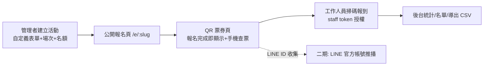

# 10. 活動報名與報到模組(Events)

把工程聯盟(ENG)的活動報名/報到系統,以品牌隔離的方式重新實作進 go-marketing-center。
服務場景:Washgo 合作廠商「洗楽」小小洗衣師親子活動(家長報名、店家報到)、TaskGo 招商研討會等。
所有品牌共用一套模型,一個活動 = 一個報名頁 + 一組場次 + 一份自訂表單 + 推薦人拆帳規則。

## 一、資料庫

新增於 `db/schema.sql`(新建環境)與 `db/migrations/001_events.sql`(套用到既有生產庫,idempotent 可重複執行):

- **`events`**:`brand_id` 品牌隔離、可選 `campaign_id` 掛勾行銷檔期、`slug` 唯一(公開網址)、
  `status`(draft/open/closed/completed)、`staff_token`(報到授權碼)、
  `form_fields` JSONB(自訂欄位定義)、`price` / `price_label`(拆帳與顯示用)、`line_add_friend_url`
- **`event_sessions`**:場次,`capacity` 為 NULL 代表不限
- **`event_referrers`**:推薦人名單,`commission_type`(percentage/fixed)+ `commission_value`
- **`event_registrations`**:報名/票券/報到狀態三合一,`qr_token` 為票券憑證,
  `referrer_id`(名單內選擇)或 `referrer_name`(名單外自填),`custom_answers` JSONB 存自訂欄位答案

拆帳金額計算規則(以**實際報到人數**計算):

- 比例制:`報到數 × 活動單價(price) × 比例% / 100`
- 固定制:`報到數 × 每人固定金額`
- 名單外自填的推薦人只列入統計,不套用拆帳規則(金額顯示為「未設定」)

## 二、後端 API(`functions/api/`)

### 管理端(需登入,`requireAuth`)

| 方法 | 路徑 | 說明 |
|---|---|---|
| GET/POST | `/api/brands/:slug/events` | 活動列表 / 建立活動 |
| GET/PUT/DELETE | `/api/events/:id` | 活動詳情 / 更新設定 / 刪除活動(含場次、推薦人、報名) |
| POST | `/api/events/:id/duplicate` | 複製活動(表單/場次/推薦人,不含報名名單) |
| PUT | `/api/events/:id/registrations/:rid` | 更新或取消報名 |
| GET/POST | `/api/events/:id/referrers` | 推薦人列表 / 新增 |
| PUT/DELETE | `/api/events/:id/referrers/:referrerId` | 更新(含停用) / 刪除推薦人 |
| GET | `/api/events/:id/registrations?search=` | 報名名單(可搜尋姓名/手機) |
| POST | `/api/events/:id/registrations/:rid/checkin` | 手動報到 / 取消報到 |
| GET | `/api/events/:id/stats` | 報到率、各場次人數、推薦人拆帳統計 |
| GET | `/api/events/:id/export` | CSV 下載(含自訂欄位、推薦人、報到時間) |

所有寫入動作皆呼叫 `logActivity`(`event.created`、`event.updated`、`event.checked_in` 等)寫入稽核時間軸。

### 公開端(免登入,`functions/api/public/`)

| 方法 | 路徑 | 說明 |
|---|---|---|
| GET | `/api/public/events/:slug` | 活動資訊 + 表單定義 + 各場次剩餘名額 + 推薦人選單(僅 `open` 狀態可見) |
| POST | `/api/public/events/:slug/register` | 報名(驗證名額上限、台灣手機格式,生成 `qr_token`) |
| POST | `/api/public/events/:slug/lookup` | 依手機號查詢已報名的票券 |
| GET | `/api/public/tickets/:qrToken` | 票券狀態(供票券頁輪詢報到結果) |

### 報到端(staff_token 授權,免登入)

| 方法 | 路徑 | 說明 |
|---|---|---|
| POST | `/api/checkin/verify` | 授權碼換活動資訊 |
| POST | `/api/checkin/scan` | 依 `qr_token` 報到(重複掃描回傳 `alreadyCheckedIn`) |

## 三、前端

### 公開頁(`src/pages/public/`,獨立於 `AppShell` 之外的輕量版型)

- `/e/:slug` — `EventRegister.tsx`:動態渲染自訂欄位、場次選擇(顯示剩餘名額)、LINE ID 選填、
  推薦人下拉選單(含「其他(自行填寫)」)
- `/e/:slug/ticket` — `EventTicket.tsx`:報名成功導向並顯示 QR 票券(`qrcode` 套件產生);
  未帶票券碼時提供手機號查票;顯示「加 LINE 好友」連結;每 10 秒輪詢報到狀態
- `/checkin` — `CheckinEntry.tsx`:輸入或貼上報到授權連結
- `/checkin/:eventId` — `CheckinScan.tsx`:相機掃碼報到(`html5-qrcode`),含手動輸入票券碼備援、
  即時成功/重複/無效回饋、本場報到計數

### 管理頁(`src/pages/event/`,`AppShell` 內,品牌範圍)

- `/:brand/events` — `EventList.tsx`:活動列表 + 建立活動
- `/:brand/events/:id` — `EventDetail.tsx`:五個分頁
  - **基本設定**:標題/說明/地點/時間/狀態/價格/LINE 連結,報名連結與報到授權連結一鍵複製
  - **場次與表單**:場次(名稱/時間/名額)與自訂欄位(文字/數字/長文字/選單 + 必填)編輯器
  - **推薦人**:新增/停用/刪除推薦人與拆帳規則
  - **報名名單**:搜尋、手動報到/取消報到、CSV 下載
  - **統計**:總報名/報到/報到率、各場次狀況、推薦人拆帳金額表

### 接線

- `src/App.tsx`:公開路由(`/e/:slug`、`/e/:slug/ticket`、`/checkin`、`/checkin/:eventId`)獨立於
  `ProtectedRoute` 之外;管理路由 `/:brand/events`、`/:brand/events/:id` 在 `AppShell` 內
- `Sidebar.tsx`「內容營運」新增「活動報名」;`BrandSwitcher.tsx` 的 `BRAND_SCOPED_PREFIXES` 加入 `events`
- `src/lib/api.ts`:管理端方法併入既有 `api` 物件,另建 `publicApi`(公開報名/查票)與
  `checkinApi`(報到驗證/掃碼)兩個獨立物件
- 新增依賴:`qrcode`(票券 QR 生成)、`html5-qrcode`(相機掃碼)

## 四、LINE 推播說明(本期只做收集,推播留二期)

報名表單收集 `line_id` 文字並存庫、票券頁放官方帳號加好友連結。真正的主動推播需要
LINE Official Account + Messaging API,且只能推給「已加好友並完成綁定(取得 `line_user_id`)」的用戶
——填寫的 LINE ID 文字無法直接推播。二期再做:OA 申請、LIFF 綁定流程、`line_user_id` 欄位與推播 API。

## 五、驗收路徑

1. 後台以 Washgo 品牌看到「洗楽 小小洗衣師」示範活動(`db/migrations/001_events.sql` 或種子資料建立)
2. 無痕視窗開 `/e/<slug>` 完成報名 → 立即看到 QR 票券
3. 用報到授權連結開掃碼頁,掃票券 QR → 顯示報到成功,後台名單同步更新
4. 後台看報到率統計、下載 CSV
5. 報名時選擇推薦人,後台統計頁看到該推薦人的報名數/報到數/拆帳金額
