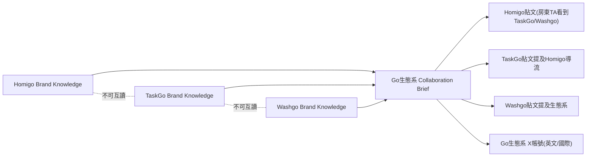

# 12. Go 生態系跨品牌整合 + 共用 X(Twitter) 頻道

## 背景

Homigo、TaskGo、Washgo 三個品牌各自獨立經營,但商業上彼此是同一個生態系的三層:

- **Homigo**(房屋/包租代管)產生報修需求
- **TaskGo**(工程/派工)承接修繕供給
- **Washgo**(洗衣/生活服務)補足租屋生活的加值服務
- **GoCoin** 是三品牌共用的點數,1 點 = NT$1,永久不過期

過去這個關係只存在於三份品牌行銷文件裡各自的片段描述,甚至互相矛盾(見 [07-collaboration.md](07-collaboration.md) 提到的 TaskGo/Washgo 案例)。本篇記錄如何在既有 Collaboration Workspace 架構下,把「跨品牌互相導流」與「共用國際 X 帳號」變成可治理、可追溯的常態內容管線,而不是把三個品牌的知識庫直接混在一起。

## 設計原則(對齊 [01-principles.md](01-principles.md))

- **Principle 2(品牌知識永不互混)**:任何內容生成都不能讀取「對方品牌」的完整 `brand_rules` / `brand_audiences`。跨品牌敘事只能來自 `collaboration_briefs`。
- **Principle 3(合作需許可)**:新建一個三品牌都加入的 Collaboration(「Go 生態系」),而不是修改任一品牌自己的知識庫。
- **Principle 6(管理者永遠有最終決策權)**:所有跨品牌內容與 X 貼文預設 `pending_review`,除非管理者主動為特定帳號開啟 `auto_publish`。
- **Principle 7(決策可追溯)**:所有生成與發布都寫入 `activity_logs`,並在 `generation_prompt_meta.source` 標記來源(`ecosystem_cross_promo` / `ecosystem_x`),方便日後區分「品牌自己的內容」與「生態系導流內容」。

## Part 1:修正矛盾規則 + 建立 Go 生態系 Collaboration

見 [db/migrations/008_ecosystem_collaboration.sql](../db/migrations/008_ecosystem_collaboration.sql):

- TaskGo 舊的 `negative_rule`(「Washgo 未上線前不得生成貼文」)不刪除,改在 `condition_note` 標記已被取代(維持 Principle 7 的可追溯性),並新增一筆 `marketing_rule` 明確聲明現況
- 新建 Collaboration「Go 生態系(Homigo × TaskGo × Washgo)」,三品牌都加入,獨立於既有的「Homigo × TaskGo 修繕生態合作」
- `collaboration_briefs` 內容包含:生態系關係圖、現況聲明、各品牌可對外提及彼此的「公開安全事實」清單、貼文角度授權、以及供 X 帳號使用的英文事實點



## Part 2:跨品牌導流內容(沿用各品牌自己的 FB/IG/Threads 帳號)

- [functions/_shared/prompts.ts](../functions/_shared/prompts.ts) 的 `buildCollaborationContext(env, collaborationId)` 讀取最新版 Brief,包成「【跨品牌合作事實 — 唯一可引用來源】」區塊
- [functions/_shared/generate.ts](../functions/_shared/generate.ts) 的 `generatePlatformPost` 新增可選參數 `collaborationContext`,只在需要提及其他品牌時附加到 system prompt 之後,**不寫回品牌自己的 systemPrompt**,維持品牌知識邊界
- [workers/scheduler/src/index.ts](../workers/scheduler/src/index.ts) 的 `generateEcosystemCrossPromo`:每週固定 2 檔(台灣時間週三/週日 20:00),依「近 7 天內做過生態系導流貼文次數最少」挑品牌輪流,確保三品牌長期均勻曝光彼此
- 每篇仍是各品牌自己發文(不需要新社群帳號),狀態預設 `pending_review`,`generation_prompt_meta.source = 'ecosystem_cross_promo'`

## Part 3:共用「Go 生態系」X(Twitter) 帳號

### 3.1 申請 X Developer 帳號(人工,系統外)

1. 前往 [developer.x.com](https://developer.x.com) 申請開發者帳號,建立一個 App(建議命名如 `go-ecosystem-bot`)
2. 訂閱付費方案(Free tier 幾乎無法穩定支援自動發文,需查詢當前 Basic/Pro 定價,依預期每月推文量評估;若一開始先以每週 2-3 則的量測試,可先觀察 Free tier 的寫入額度是否足夠,不夠再升級)
3. 在 App 的 **User authentication settings** 開啟 OAuth 2.0,Type 選 **Confidential client**(伺服器端自動發文需要用 client secret 換 refresh token,不要選 Public client / PKCE-only),勾選 scope:`tweet.read`、`tweet.write`、`users.read`、`offline.access`、`media.write`(配圖上傳必須,少了這個 scope 上傳圖片會 403)
4. 記下 **Client ID** 與 **Client Secret**,設定到 Cloudflare Pages 環境變數 `X_CLIENT_ID` / `X_CLIENT_SECRET`(`wrangler pages secret put X_CLIENT_ID` / `X_CLIENT_SECRET`)
5. 用官方 OAuth 2.0 Authorization Code + PKCE 流程跑一次授權(可用 Postman 的 OAuth2 helper,或任何一次性腳本),得到該帳號的 `access_token` + `refresh_token`
6. 到「品牌合作」頁面展開「Go 生態系」Collaboration,填入 X handle、剛拿到的 `access_token` 與 `refresh_token`,按「測試連線」確認成功(見 [functions/api/collaborations/[id]/social-accounts/test.ts](../functions/api/collaborations/%5Bid%5D/social-accounts/test.ts))

### 3.2 資料庫變更

見 [db/migrations/009_x_ecosystem_account.sql](../db/migrations/009_x_ecosystem_account.sql):

- `contents` / `brand_social_accounts` 都新增 `collaboration_id`,`brand_id` 改為可空,CHECK 約束「brand_id 或 collaboration_id 至少一個非空」(比照既有 `meetings` / `proposals` 的雙範圍模式)
- `brand_social_accounts` 新增 `refresh_token_enc`:X 的 access token 僅 2 小時效期,且每次 refresh 後舊的 `refresh_token` 立即失效(輪替式),所以每次續期都要覆寫存檔,不能沿用同一組
- 新增 `ecosystem_ai` agent role + 「Go Ecosystem AI」agent(`brand_id = NULL`),只授權 `agent_permissions.scope = 'read_collaboration_brief'`,不得存取任一品牌完整知識庫
- 種子一筆 `platform = 'x'`、`collaboration_id = <Go 生態系 id>` 的 `brand_social_accounts`(初始 `disconnected`,待人工填入 token)

### 3.3 X API 封裝

見 [functions/_shared/x.ts](../functions/_shared/x.ts):

- `getXAccount(env, collaborationId)`:依 `collaboration_id + platform='x'` 讀取並解密 token
- `refreshXToken(env, account)`:呼叫 `POST https://api.x.com/2/oauth2/token`(`grant_type=refresh_token`,HTTP Basic 認證帶 `X_CLIENT_ID:X_CLIENT_SECRET`),把新的 access/refresh token 立即加密覆寫回去;失敗會把帳號標記 `error` 並在 `notes` 提示需要重新走一次 OAuth 授權
- `uploadImageMedia(accessToken, imageUrl)`:單次 multipart `POST https://api.x.com/2/media/upload`(圖片不需要 chunked upload,影片才需要),下載 R2 上的生成圖後轉傳,回傳 `media_id`;需要 token 帶 `media.write` scope
- `publishTweet` / `publishTweetThread`:`POST https://api.x.com/2/tweets`,Thread 用 `reply.in_reply_to_tweet_id` 串接;兩者都接受選填的 `imageUrl`,會先呼叫 `uploadImageMedia` 換 `media_id` 再附加到第一則推文(`media.media_ids`),上傳失敗會 fallback 成純文字、不會擋住發文
- `splitIntoTweetThread`:把一篇長文依句子/段落邊界切成多則推文(280 字硬限制),供未來需要「切文字」的場景使用;目前的 `generateEcosystemXPost` 直接讓模型輸出多則推文陣列,不透過這個函式

### 3.4 API/UI

- [functions/api/collaborations/[id]/social-accounts.ts](../functions/api/collaborations/%5Bid%5D/social-accounts.ts):GET 讀取、PUT upsert collaboration 範圍的社群帳號(目前只有 `platform=x`)
- [functions/api/collaborations/[id]/social-accounts/test.ts](../functions/api/collaborations/%5Bid%5D/social-accounts/test.ts):呼叫 `GET /2/users/me` 測試連線
- 前台在「品牌合作」頁面(`src/pages/collaboration/CollaborationList.tsx`),展開「Go 生態系」Collaboration 時會出現 X 帳號設定區塊,可填帳號名稱/handle/access token/refresh token,並開關「排程自動發布」

### 3.5 行程表(待審核 / 已排定 / 已發布 / 失敗)

品牌自己的「行程表」(`/:brand/schedule`,見 [functions/api/brands/[slug]/schedule.ts](../functions/api/brands/%5Bslug%5D/schedule.ts))是以 `publishing_jobs` 為主表,只篩 `c.brand_id = 該品牌`,Go 生態系的 X 貼文(`brand_id = NULL`,`collaboration_id` 非空)完全不會出現在任何品牌的行程表裡,而且 `auto_publish` 關閉時 pending_review 的內容根本還沒有 `publishing_jobs`。因此另開一組 collaboration 範圍的行程表:

- [functions/api/collaborations/[id]/schedule.ts](../functions/api/collaborations/%5Bid%5D/schedule.ts):以 `contents` 為主表、`LEFT JOIN` 最新一筆非 `cancelled` 的 `publishing_jobs`,所以「已生成但還沒排入發布」的草稿也能顯示(`jobStatus = null` 時前端顯示「待審核」)
  - `POST { action: 'retry', jobId }`:失敗的 job 重新排入(同品牌行程表邏輯)
  - `POST { action: 'approve_publish', contentId }`:待審核且尚未有 job 的內容,人工核准後立即建立 `scheduled` job(`scheduled_at = now()`),下一個 30 分鐘 tick 的 `publishDueJobs` 就會真正發布
- 前台 [src/pages/collaboration/EcosystemSchedule.tsx](../src/pages/collaboration/EcosystemSchedule.tsx)(路由 `/collaborations/:id/schedule`):跟品牌行程表一樣的週曆卡片版面,卡片展開可看到完整 Thread 文案(依 `\n---\n` 拆開並標號)、配圖、發布結果連結;待審核卡片有「核准並排入發布」按鈕,失敗卡片有「重新排入發布」按鈕
- 從「品牌合作」頁面展開「Go 生態系」時,X 帳號設定區塊旁邊有「查看行程表」按鈕可以直接跳過去

## Part 4:X 排程與內容策略

見 [workers/scheduler/src/index.ts](../workers/scheduler/src/index.ts):

- `generateEcosystemXPostSlot`:每天固定 2 檔(台灣時間 09:00 / 21:00,對應美東晚間/早晨的活躍時段),用 [functions/_shared/prompts.ts](../functions/_shared/prompts.ts) 的 `ECOSYSTEM_X_SYSTEM_PROMPT`(全英文、獨立於三品牌的「Go 生態系操盤手」人格)生成內容
  - 角度輪替(`ECOSYSTEM_X_ANGLES`,排除最近 3 篇用過的角度,共 6 種角度):單推觀點 / Thread 產業敘事 / Thread 操盤手視角 / 單品牌聚焦(TaskGo・Homigo・Washgo 各一種,明確點名該品牌,只用該品牌在 Brief 裡的事實,不強行帶另外兩個品牌)
  - 素材來源見 [db/migrations/010_ecosystem_brief_enrichment.sql](../db/migrations/010_ecosystem_brief_enrichment.sql):使用者提供 4 份內部簡報(Digital Backbone 下載版/桌面版、Digital Nexus、Smart Management),逐頁人工審閱後只把「產業痛點、架構敘事、各品牌功能亮點、TAM 市場規模、跨品牌自動化情境故事、未來擴張藍圖、技術特色」寫入 Brief v2;審閱時發現的具體付費客戶數、ARPU/CAC/LTV、逐年 ARR 預測、募資金額與估值、股權配置、具體定價與抽成費率等一律排除,不寫入 Brief(AI 只能引用 Brief 內容,沒寫進去的事實 AI 就看不到、也不能自行推論補上)
  - 素材只吃 `buildCollaborationContext` 讀到的 Go 生態系 Brief,不吃任何單一品牌的 `BrandContext`
  - 每篇同時配一張 hero image:模型回傳的 `imagePrompt`(1-2 句抽象視覺場景)套上固定的 `ECOSYSTEM_X_IMAGE_STYLE`(科技感、抽象資料流動、深色背景+霓虹漸層,面向國際 PropTech/VC 圈的視覺語言),16:9 比例配合 X 卡片顯示;配圖失敗不擋文字貼文
  - 生成結果存進 `contents`(`brand_id = NULL, collaboration_id = <Go 生態系 id>`),Thread 的多則推文用 `\n---\n` 分隔存在同一個 `content_versions.body`,圖存進 `content_assets`(發布時 `publishDueJobs` 用既有的 LATERAL JOIN 自動撈到)
- `refreshXTokens`:掛在既有的 30 分鐘 tick 上(`halfHourlyDispatch`),SQL 先篩選「20 分鐘內到期」才動作,幾乎每次 tick 都是 no-op,只有真的快過期才會呼叫 X 的 token 續期
- `publishDueJobs` 新增 `platform === 'x'` 分支:依 `content_id → collaboration_id` 找到帳號,把 body 依 `\n---\n` 切回推文陣列,單則用 `publishTweet`,多則用 `publishTweetThread`

### 內容範例(供人工審閱參考基準)

- 單推:「A landlord in Taipei reports a leak at 2am. By 7am, three verified repair quotes are waiting. That's not a feature — that's three apps talking to each other.」
- Thread 首則 hook:「We didn't build one SaaS app. We built an ecosystem where demand from App A becomes supply for App B. Here's how 3 vertical apps in Taiwan are quietly becoming a PropTech OS. 🧵」
- 單品牌聚焦(TaskGo)首則 hook:「TaskGo turns a chaotic group chat full of site photos into a dispatch queue with GPS check-ins and live cost tracking. Here's what changed for a 20-person crew. 🧵」

## 治理與風控

- 所有生態系內容(跨品牌導流 + X)預設 `pending_review`,除非管理者主動為該帳號開啟 `auto_publish`
- `activity_logs` 記錄所有生成與發布動作,`collaboration_id` 欄位讓這些紀錄與品牌自己的活動分開追蹤
- X API 付費方案有月推文上限;目前每天 2 篇(月約 60 篇,含 Thread 內的每則推文也計入寫入額度)仍遠低於一般付費方案的月上限,若未來要再提高頻率,先確認方案額度再調整 `ECOSYSTEM_X_HOURS_TW`
- 跨品牌貼文(Part 2)務必先人工審閱幾輪再考慮開自動發布,避免讀者感覺「品牌互相商業互吹」

## 手動測試指令(需帶 scheduler 的 secret)

```bash
# 生成一篇跨品牌導流貼文(不受星期限制,立即生成)
curl "https://<scheduler-worker>/?task=ecosystem&secret=$SCHEDULER_SECRET"

# 生成一篇 Go 生態系 X 貼文(不受星期限制,立即生成)
curl "https://<scheduler-worker>/?task=ecosystem-x&secret=$SCHEDULER_SECRET"

# 立即檢查並續期快過期的 X token
curl "https://<scheduler-worker>/?task=refresh-x-tokens&secret=$SCHEDULER_SECRET"

# 立即執行到期的發布佇列(含 X)
curl "https://<scheduler-worker>/?task=publish&secret=$SCHEDULER_SECRET"
```
